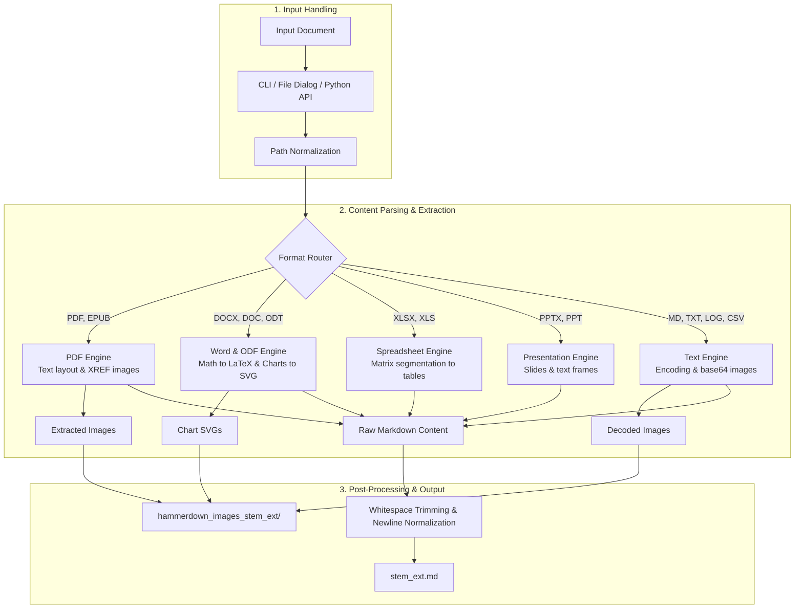
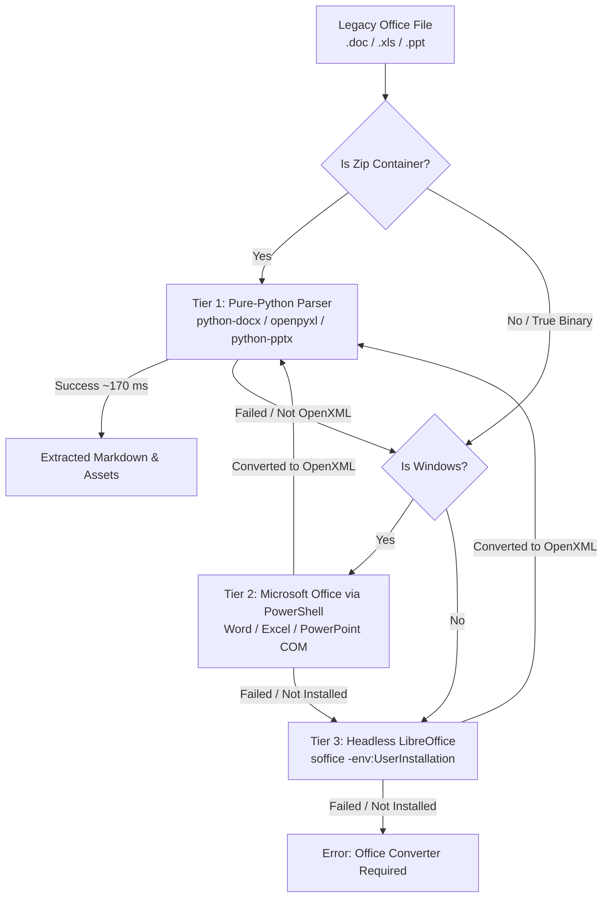

# Architecture

This document describes the high-level architecture and processing pipeline of `hammerdown`.

## Pipeline Overview

When you convert a document with `hammerdown`, processing follows three stages:

## Pipeline Stages

The conversion pipeline consists of three corresponding stages:

### 1. Input Handling

- **Input Document**: source document path supplied by user or script
- **CLI / File Dialog / Python API**: parses flags (`-i`, `-f`, `-q`, `-v`), opens graphical file picker if no files are passed, or accepts direct Python calls
- **Path Normalization**: resolves Windows and WSL paths, strips quotes, and verifies file existence

### 2. Content Parsing & Extraction

- **Format Router**: detects file extension and delegates work to the corresponding parser
- **PDF Engine**: extracts document layout via PyMuPDF4LLM and original raster images by XREF via PyMuPDF
- **Word & ODF Engine**: extracts text and tables, translates equations (OMML and MathML) into LaTeX via `symbols.json`, and renders DrawingML charts as SVG
- **Spreadsheet Engine**: segments cell matrices, trims empty borders, and builds clean Markdown tables
- **Presentation Engine**: converts slides, headers, and text frames into structured sections
- **Text Engine**: auto-detects encodings and decodes inline base64 images into standalone image files

### 3. Post-Processing & Output

- **Asset Storage (`hammerdown_images_<stem>_<ext>/`)**: writes raster images, SVG charts, and decoded pictures to disk
- **Whitespace Trimming & Newline Normalization**: converts line endings to `\n`, strips trailing whitespace on every line, and guarantees a final newline
- **File Output (`<stem>_<ext>.md`)**: writes the final Markdown document next to the source file (or overwrites plain-text source files when `-w`/`--overwrite` is enabled)

## Cascade Parser Pipeline for Legacy Formats

Documents with legacy extensions (`.doc`, `.xls`, `.ppt`) are processed through a multi-tier fallback cascade designed primarily for execution speed and broad format compatibility.

Launching external office suites (such as LibreOffice or Microsoft Word) incurs high startup latency and system overhead. Whenever files are structured as XML archives underneath, parsing them directly in pure Python takes ~170 ms compared to ~5,320 ms via LibreOffice `--` delivering over 30x faster conversions without requiring external software installations.

The processing cascade proceeds as follows:
1. tier 1 (fast in-memory Python parsing): inspects whether the input is a valid zip package. If parsing succeeds via `python-docx`, `openpyxl`, or `python-pptx`, conversion completes in milliseconds in pure Python
2. tier 2 (Microsoft Office automation on Windows): on Windows systems, `hammerdown` first attempts conversion using native desktop Microsoft Office (Word, Excel, or PowerPoint) via PowerShell COM automation
3. tier 3 (headless LibreOffice conversion): if Microsoft Office is unavailable or the platform is Linux/macOS, `hammerdown` invokes headless LibreOffice (`soffice`) with isolated user profiles (`-env:UserInstallation`) to export modern OpenXML formats
