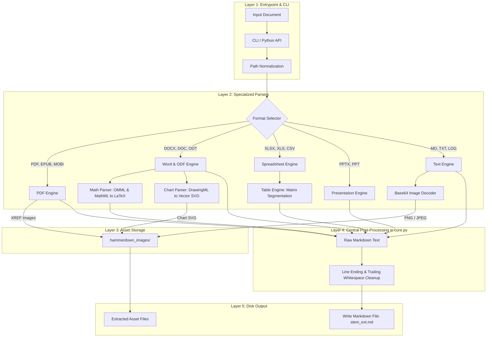

# Architecture

This document describes the high-level architecture and data flow of `hammerdown`.

## Pipeline Overview

When you pass one or multiple documents to `hammerdown`, the converter runs through a straightforward pipeline:

## System Layers

The codebase is split into three main layers:

1. **CLI and entrypoint** (`hammerdown.cli`, `hammerdown.__main__`):
   - parses command-line arguments (`--in-place`, `--force`, `--quiet`, etc.)
   - triggers OS file pickers when run without arguments
   - registers system file-manager context menu handlers

2. **Core orchestration** (`hammerdown.core`):
   - manages output filenames (`<name>_<ext>.md`)
   - creates output directories and manages collision protection
   - exposes high-level functions `to_markdown()` and `convert_file()`
   - re-exports specialized parser functions for Python developers

3. **Parsers** (`hammerdown.parsers`):
   - `pdf.py`: PDF and e-book parsing via PyMuPDF and PyMuPDF4LLM, extracting raw images
   - `office.py`: DOCX, XLSX, PPTX extraction, plus fallback runners for older formats (.doc, .xls, .ppt)
   - `odt.py`: native OpenDocument Text reader with formula and image extraction
   - `math.py`: conversion of equation XML trees (Word OMML and MathML) into standard LaTeX math formulas using symbol mappings in `symbols.json`
   - `charts.py`: conversion of embedded office charts into standalone SVG vector images
   - `tables.py`: intelligent detection, trimming, and segmentation of complex and sparse table matrices into clean Markdown tables
   - `text.py`: encoding detection, CSV dialect sniffing, and base64 image extraction
