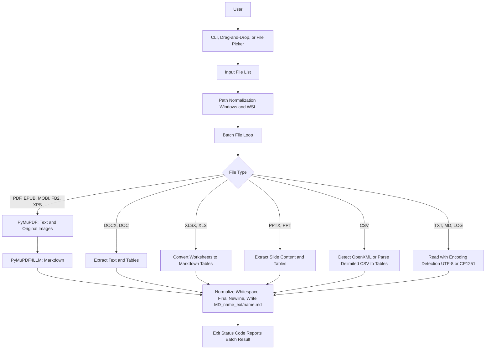

# md-maker Technical Specification

## Overview

`md-maker` is a cross-platform command-line utility for converting documents (PDF, Word, Excel, PowerPoint, e-books, plain text, and CSV) into clean Markdown. For each processed document, an output directory `MD_<name>_<ext>` is created adjacent to the source file, containing the output Markdown file and an `images/` directory for extracted assets.

## Dependencies

- `pymupdf` -- low-level PDF document parsing and raw raster image extraction by XREF
- `pymupdf4llm` -- PDF layout analysis and Markdown compilation
- `python-docx` -- Microsoft Word document (.docx) text and table parsing
- `openpyxl` -- Microsoft Excel workbook (.xlsx) table extraction and XLSX-formatted CSV files
- `python-pptx` -- Microsoft PowerPoint presentation (.pptx) slide and table parsing
- `onnxruntime` -- runtime engine for model-based layout structure analysis
- standard library (`argparse`, `pathlib`, `shutil`, `tempfile`, `subprocess`, `csv`, `io`, `zipfile`, `winreg`) -- CLI, file operations, system integration, file selection dialogs

Runtime dependencies are declared in `requirements.txt` and `pyproject.toml`.

## Execution Scenarios

When invoking `md-maker`, the following execution scenarios are supported:
- CLI terminal execution: `md-maker document.pdf`
- batch file processing: `md-maker file1.pdf file2.docx`
- drag-and-drop: passing files as arguments when dropped onto executable
- interactive fallback: system file picker dialog (WPF dialog on Windows, Tkinter on Unix) when launched without arguments
- file manager integration: context menu via Windows Registry for PDF files, Nautilus script on Linux
- self-installation: `md-maker --install`; Removal: `md-maker --uninstall`
- self-update: `md-maker --update`

The installation process is fully local and does not require administrator privileges or network requests. On Windows, `--install` copies the application to `%LOCALAPPDATA%\Programs\md-maker` and registers a user-level shell extension for `.pdf`. On Linux, it places a launcher in `~/.local/bin` and a Nautilus script in `~/.local/share/nautilus/scripts`. On macOS, it installs the launcher script in `~/.local/bin`.

## Processing Pipeline



## Legacy Format Conversion (.doc, .xls, .ppt)

Legacy Microsoft Office formats are handled seamlessly:
- **Direct OpenXML Inspection**: files that are internally ZIP archives (such as OpenXML documents saved with legacy extensions) are parsed directly via standard handlers for instant cross-platform execution
- **LibreOffice / soffice**: headless conversion attempted on all platforms for binary OLE files
- **COM Automation (Windows)**: `win32com.client` fallback if Microsoft Office is installed

If neither conversion engine is available, an actionable error is logged.

## Output Structure

```text
documents/
├── document.pdf
└── MD_document_pdf/
    ├── document.md
    └── images/
        ├── document_p001_xref105.png
        └── document_p002_xref112.png
```

Original raster images embedded in PDF files are extracted by XREF reference when their dimensions are at least 50 x 50 pixels. Output files undergo automatic trailing whitespace stripping and final newline normalization.

## Build and Release Pipeline

`pyproject.toml` contains Python package metadata and console entry points. Pushing a tag matching `v*` triggers GitHub Actions workflows:
1. executes unit, CLI, and golden test suite
2. compiles PyInstaller standalone binaries for Windows x64, Linux x64, macOS x64, and macOS ARM64
3. generates SHA256 checksums
4. publishes assets to GitHub Releases
